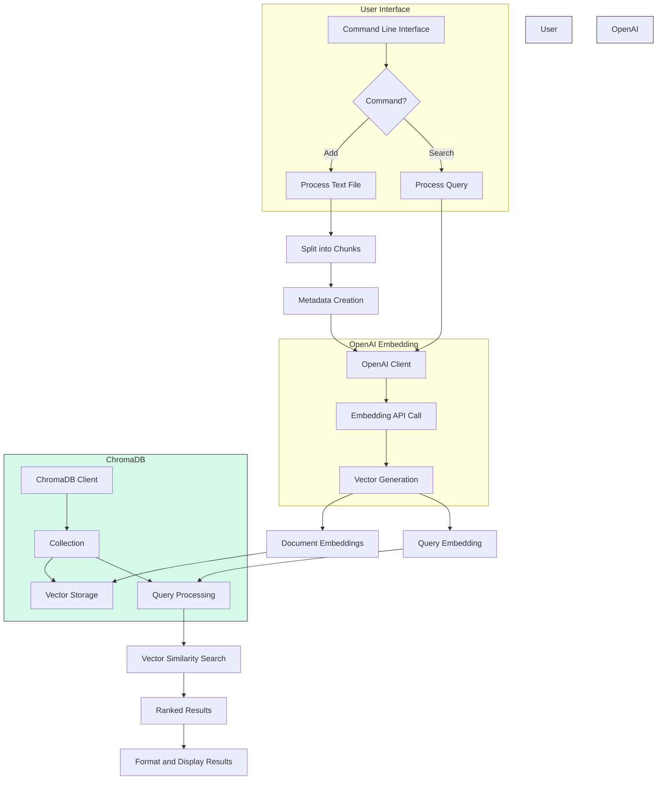

# Semantic Search Application

A Python-based semantic search application that uses OpenAI embeddings and ChromaDB to enable powerful semantic search capabilities for text documents.

## Overview

This application allows you to:
- Process text documents and convert them into semantic vector embeddings
- Store these embeddings efficiently using ChromaDB 
- Perform semantic searches on your document collection
- Find relevant content based on meaning, not just keywords

## Architecture

The application follows this architecture:



## Differences between Semantic and Traditional Search

| Traditional Search | Semantic Search |
|--------------------|----------------|
| Matches exact keywords | Understands meaning and intent |
| Uses inverted indices | Uses vector embeddings |
| Uses boolean matching | Uses similarity metrics |
| Lexical analysis | Contextual understanding |
| Statistical ranking | Language model integration |

## Installation

1. Clone the repository:
```bash
git clone https://github.com/yourusername/semantic-search.git
cd semantic-search
```

2. Set up a virtual environment:
```bash
# Create a virtual environment
python -m venv venv

# Activate the virtual environment
# On Windows:
venv\Scripts\activate
# On macOS/Linux:
source venv/bin/activate
```

3. Install the required packages:
```bash
pip install -r requirements.txt
```

4. Create a `.env` file in the project root with your OpenAI API key:
```
OPENAI_API_KEY=your_api_key_here
```

## Project Structure

```
semantic-search/
├── .env                    # Environment variables (API keys)
├── .gitignore              # Git ignore file
├── README.md               # Project documentation
├── requirements.txt        # Project dependencies
├── semantic_search/        # Main package
│   ├── __init__.py         # Package initialization
│   ├── cli.py              # Command line interface
│   ├── config.py           # Configuration handling
│   ├── embedding.py        # Embedding generation module
│   ├── search.py           # Main semantic search class
│   └── utils.py            # Utility functions
└── tests/                  # Test directory
    ├── __init__.py
    ├── test_embedding.py
    └── test_search.py
```

## Usage

First, make sure your virtual environment is activated:

```bash
# On Windows:
venv\Scripts\activate
# On macOS/Linux:
source venv/bin/activate
```

The application provides a simple command-line interface:

### Adding Documents

```bash
python -m semantic_search.cli add path/to/your/document.txt --collection documents
```

### Searching

```bash
python -m semantic_search.cli search "your search query here" --collection documents --results 5
```

## How It Works

1. **Document Processing**: 
   - Text documents are split into manageable chunks
   - Each chunk is processed and assigned metadata

2. **Embedding Generation**:
   - The OpenAI API converts text chunks into high-dimensional vectors
   - These vectors capture the semantic meaning of the text

3. **Vector Storage**:
   - ChromaDB efficiently stores and indexes the vectors
   - Metadata is preserved for context

4. **Semantic Search**:
   - User queries are converted to the same vector space
   - ChromaDB finds the most similar vectors using cosine similarity
   - Results are ranked and displayed with relevance scores

## Example

```bash
# Add a document
python -m semantic_search.cli add research_paper.txt

# Search for semantically similar content
python -m semantic_search.cli search "impact of climate change on coral reefs"
```

Even if the exact phrase "impact of climate change on coral reefs" doesn't appear in your documents, the application will find semantically relevant content about climate effects on marine ecosystems.

## License

This project is licensed under the MIT License - see the LICENSE file for details.
