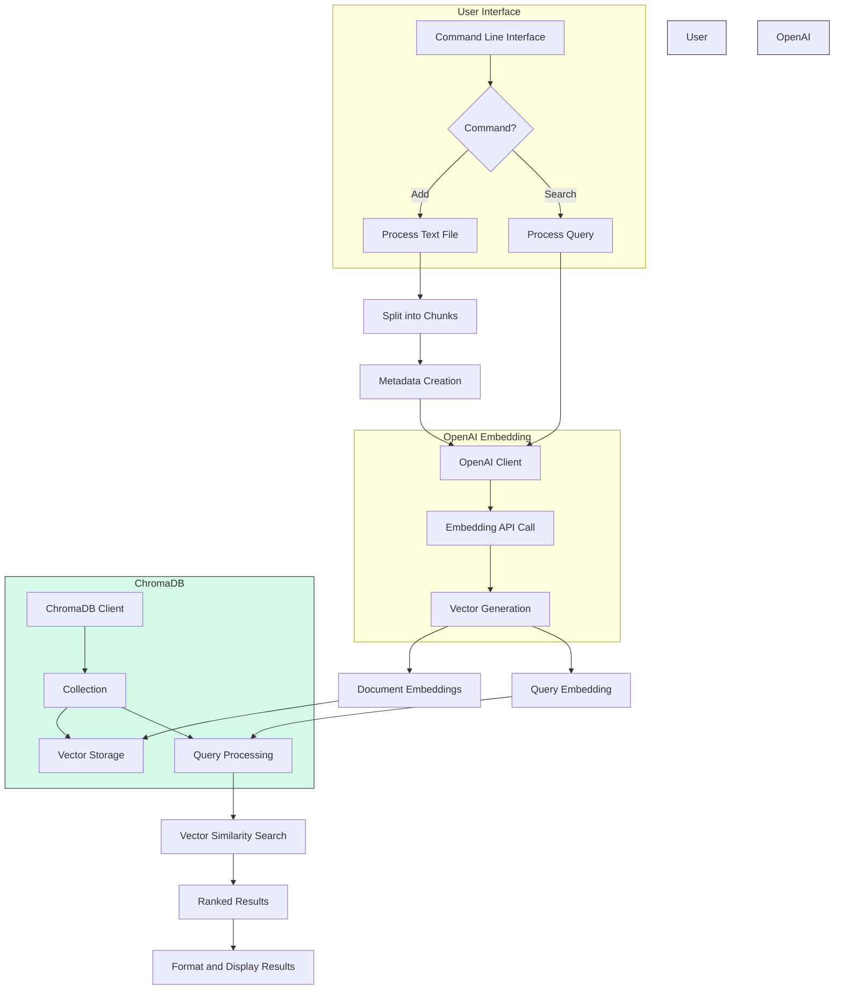

# Semantic Search Application

A Python-based semantic search application that uses OpenAI embeddings and ChromaDB to enable powerful semantic search capabilities for text documents.

## Overview

This application allows you to:
- Process text documents and convert them into semantic vector embeddings
- Store these embeddings efficiently using ChromaDB 
- Perform semantic searches on your document collection
- Find relevant content based on meaning, not just keywords

## Architecture

The application follows this architecture:



## Differences between Semantic and Traditional Search

| Traditional Search | Semantic Search |
|--------------------|----------------|
| Matches exact keywords | Understands meaning and intent |
| Uses inverted indices | Uses vector embeddings |
| Uses boolean matching | Uses similarity metrics |
| Lexical analysis | Contextual understanding |
| Statistical ranking | Language model integration |

## Installation

1. Clone the repository:
```bash
git clone https://github.com/rimironenko/rostcamp.git
cd workshops/may-2025/workshop3/semantic-search 
```

2. Set up a virtual environment:
```bash
# Create a virtual environment
python3 -m venv venv

# Activate the virtual environment
# On Windows:
venv\Scripts\activate
# On macOS/Linux:
source venv/bin/activate
```

3. Install the required packages:
```bash
pip install -r requirements.txt
```

4. Create a `.env` file in the project root with your OpenAI API key:
```
OPENAI_API_KEY=your_api_key_here
```

## Project Structure

```
semantic-search/
├── .env                    # Environment variables (API keys)
├── .gitignore              # Git ignore file
├── README.md               # Project documentation
├── requirements.txt        # Project dependencies
├── semantic_search/        # Main package
│   ├── __init__.py         # Package initialization
│   ├── cli.py              # Command line interface
│   ├── config.py           # Configuration handling
│   ├── embedding.py        # Embedding generation module
│   ├── search.py           # Main semantic search class
│   └── utils.py            # Utility functions
```

## Usage

First, make sure your virtual environment is activated:

```bash
# On Windows:
venv\Scripts\activate
# On macOS/Linux:
source venv/bin/activate
```

The application provides a simple command-line interface:

### Adding Documents

```bash
python3 -m semantic_search.cli add path/to/your/document.txt --collection documents
```

### Searching

```bash
python -m semantic_search.cli search "your search query here" --collection documents --results 5
```

## How It Works

1. **Document Processing**: 
   - Text documents are split into manageable chunks
   - Each chunk is processed and assigned metadata

2. **Embedding Generation**:
   - The OpenAI API converts text chunks into high-dimensional vectors
   - These vectors capture the semantic meaning of the text

3. **Vector Storage**:
   - ChromaDB efficiently stores and indexes the vectors
   - Metadata is preserved for context

4. **Semantic Search**:
   - User queries are converted to the same vector space
   - ChromaDB finds the most similar vectors using cosine similarity
   - Results are ranked and displayed with relevance scores

## Example

```bash
# Add a document
python3 -m semantic_search.cli add sample_document.txt

# Search for semantically similar content
python3 -m semantic_search.cli search "How does semantic search work?"
python3 -m semantic_search.cli search "What technologies store AI text representations?"
```

Even if the exact phrase "impact of climate change on coral reefs" doesn't appear in your documents, the application will find semantically relevant content about climate effects on marine ecosystems.

## Troubleshooting

### Memory Issues

If you encounter a "killed" message or memory errors when processing large files:

1. **Adjust Configuration Parameters**:
   
   Edit `semantic_search/config.py` to reduce memory usage:
   ```python
   # Reduce these values for large files
   CHUNK_SIZE = 300  # Smaller chunks (default is 500)
   CHUNK_OVERLAP = 50  # Less overlap (default is 100)
   MAX_CHUNKS_PER_BATCH = 3  # Process fewer chunks at once (default is 5)
   ```

2. **Process Smaller Files**:
   
   Split large documents into smaller files before processing.

3. **System Resources**:
   
   - Close other memory-intensive applications
   - Ensure you have sufficient free RAM
   - Consider using a machine with more memory for very large documents

The application is designed to gracefully handle memory constraints by processing documents in batches, but very large files may still require configuration adjustments.

### ChromaDB Warnings

If you see a warning message about deprecated ChromaDB configuration:

1. **Update ChromaDB**:
   ```bash
   pip install --upgrade chromadb
   ```

2. **Clear Previous Database**:
   If you're still experiencing issues after updating, you might need to clear your previous database:
   ```bash
   rm -rf ./chroma_db
   ```
   Note: This will delete all your indexed documents, so you'll need to re-add them.

The code has been updated to use the current ChromaDB API, but previous database formats might cause compatibility warnings.

## License

This project is licensed under the MIT License - see the LICENSE file for details.
